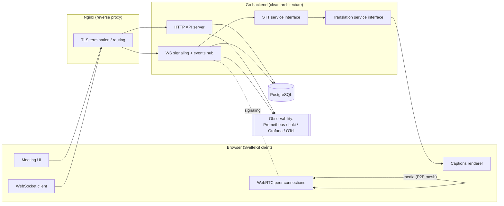
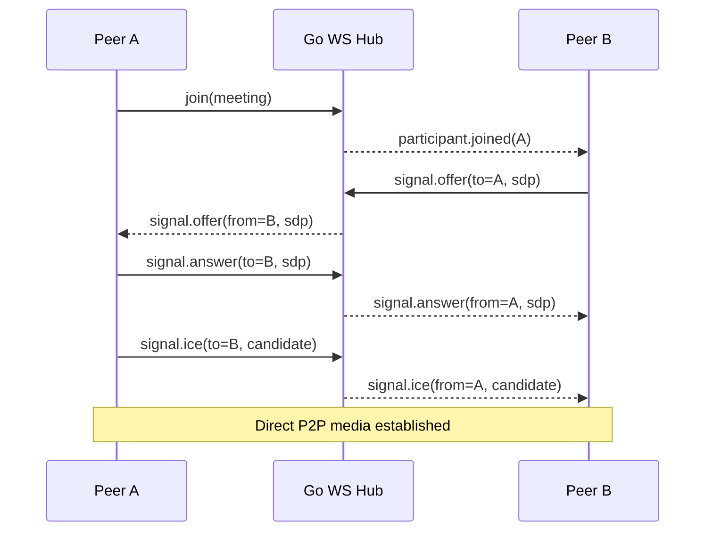
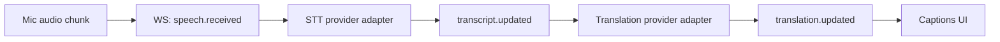

# Architecture — Real-time AI Meeting Platform

> Status: Phase 0 (Planning). This is the source-of-truth architecture document.
> Update `docs/project-memory.md` whenever a decision here changes.

## 1. Product Summary

A Google-Meet-inspired platform focused on:

- Creating meeting rooms with shareable URLs
- Browser-based video/audio calls (WebRTC)
- Live speech-to-text (STT)
- Live translated captions

The MVP must be runnable with a single command (`docker compose up`) and built on a
foundation that can scale toward a production-grade communication platform.

## 2. Design Principles

1. **Working MVP first**, but no architectural dead-ends.
2. **Clean architecture** on the backend — clear package boundaries, no giant files.
3. **Provider independence** — STT and translation are swappable behind interfaces.
4. **Realtime-first** — WebSockets for signaling/events, WebRTC for media.
5. **Observability from day one** — structured logs, metrics, tracing hooks.
6. **Scale path, not scale now** — start with WebRTC mesh; design for SFU migration.

## 3. High-Level System Diagram



## 4. Component Responsibilities

### Frontend (SvelteKit + TypeScript)
- Meeting lobby + room UI, device selection (camera/mic).
- WebRTC client: getUserMedia, peer connection lifecycle, mesh negotiation.
- WebSocket client: signaling + realtime events (participants, captions).
- Captions display: original transcript + translated subtitles.
- Captures audio and streams short chunks for transcription.

### Backend (Go)
- **HTTP API**: meetings CRUD, health, readiness, metrics.
- **WS hub**: per-room hubs, fan-out events, signaling relay.
- **STT service**: interface + pluggable provider adapters.
- **Translation service**: interface + pluggable provider adapters.
- **Auth-ready**: structure supports adding auth later (middleware, user context) without rewrites.

### Database (PostgreSQL)
- Meetings, participants, transcript/translation segments (optional persistence).
- Migrations, indexing, relational integrity.

### Nginx
- Reverse proxy for frontend + backend, WebSocket upgrade pass-through.
- SSL termination later, load-balancing preparation.

## 5. Backend Clean Architecture

```
backend/
  cmd/server/            # entrypoint (main.go)
  internal/
    config/              # env-driven config
    http/                # router, handlers, middleware (transport layer)
    ws/                  # websocket hub, client, signaling
    meeting/             # domain: service + repository interface
    transcription/       # STT provider interface + adapters
    translation/         # translation provider interface + adapters
    storage/postgres/    # repository implementations + db pool
    observability/       # logger, metrics, tracing
    platform/            # shared utils (ids, httputil)
  migrations/            # SQL migrations
```

Dependency rule: `http`/`ws` (transport) → domain services (`meeting`, `transcription`,
`translation`) → repository interfaces. Implementations (`storage/postgres`,
provider adapters) are injected at composition root (`cmd/server`). Domain code never
imports transport or concrete infrastructure.

## 6. Realtime Media (WebRTC) — MVP Decision

**Decision: WebRTC mesh (full P2P), no media server for MVP.**

- Each participant connects directly to every other participant.
- Signaling (SDP offer/answer, ICE candidates) relayed through the Go WS hub.
- STUN via public `stun:stun.l.google.com:19302`; TURN is a later add-on for NAT traversal.

Rationale: zero media-server infra, simplest to ship. Mesh is fine for small rooms
(~3–5 participants). Connection count grows O(n²), so we **prepare for SFU migration**
(e.g., Pion/LiveKit/mediasoup) by keeping signaling abstract and not assuming P2P in the
event schema.



## 7. AI Pipeline (STT → Translation → Captions)



- Audio chunks captured client-side, sent over WS (binary or base64) to backend.
- Backend forwards to STT adapter, emits `transcript.updated`.
- Transcript forwarded to translation adapter, emits `translation.updated`.
- Both providers sit behind interfaces (`transcription.Provider`, `translation.Provider`)
  so we can swap implementations without touching the hub.

## 8. Scale Considerations ("100k users")

| Concern | MVP approach | Scale path |
|---|---|---|
| Media | WebRTC mesh | SFU (Pion/LiveKit) |
| WS fan-out | in-process room hubs | Redis pub/sub or NATS across instances |
| Sessions/state | in-memory room registry | external store (Redis) |
| DB | single Postgres | read replicas, partition transcripts |
| STT cost/latency | single provider | provider routing + batching/streaming |
| Stateless API | yes | horizontal scaling behind nginx/LB |

## 9. Security & Auth Readiness

- Request context carries `request_id`, and (later) `user_id`.
- Middleware chain ready for auth injection.
- Meetings identified by unguessable slugs (not sequential IDs) in URLs.
- Input validation at transport boundary; CORS locked to known origins.

See `docs/database-design.md`, `docs/api-design.md`, `docs/docker-architecture.md`,
`docs/observability.md`, and `docs/stt-decision.md` for detailed sub-designs.
