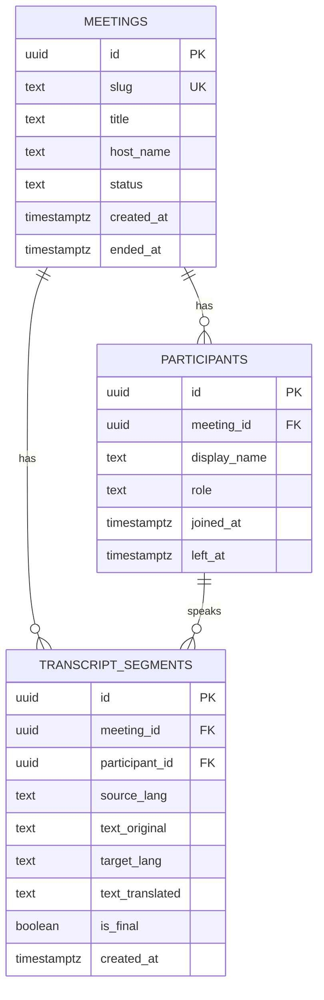

# Database Design — PostgreSQL

> Production-ready relational design with migrations and indexing.
> Migrations live in `backend/migrations/`.

## Conventions
- UUID primary keys (`gen_random_uuid()` via `pgcrypto`).
- `created_at` / `updated_at` as `timestamptz` defaulting to `now()`.
- Soft delete via `deleted_at` only where needed (not in MVP).
- Public-facing identifiers use a short, unguessable `slug` (not the UUID/PK).

## ER Diagram

## Tables

### `meetings`
| column | type | notes |
|---|---|---|
| id | uuid PK | `gen_random_uuid()` |
| slug | text UNIQUE NOT NULL | shareable id, e.g. `abc-defg-hij` |
| title | text | optional |
| host_name | text | display name of creator (pre-auth) |
| status | text NOT NULL | `active` \| `ended` (default `active`) |
| created_at | timestamptz NOT NULL | default `now()` |
| ended_at | timestamptz NULL | set when closed |

Indexes: unique on `slug`; index on `status`.

### `participants`
| column | type | notes |
|---|---|---|
| id | uuid PK | |
| meeting_id | uuid FK → meetings(id) ON DELETE CASCADE | |
| display_name | text NOT NULL | |
| role | text NOT NULL | `host` \| `guest` (default `guest`) |
| joined_at | timestamptz NOT NULL | default `now()` |
| left_at | timestamptz NULL | |

Indexes: index on `meeting_id`.

### `transcript_segments` (optional persistence in Phase 4)
| column | type | notes |
|---|---|---|
| id | uuid PK | |
| meeting_id | uuid FK → meetings(id) ON DELETE CASCADE | |
| participant_id | uuid FK → participants(id) ON DELETE SET NULL | |
| source_lang | text | e.g. `en` |
| text_original | text NOT NULL | STT output |
| target_lang | text NULL | e.g. `ru` |
| text_translated | text NULL | translation output |
| is_final | boolean NOT NULL | partial vs final segment (default false) |
| created_at | timestamptz NOT NULL | default `now()` |

Indexes: index on `(meeting_id, created_at)`.

## Scale Notes
- `transcript_segments` is the high-volume table → partition by `created_at` (monthly)
  or by `meeting_id` hash when volume grows.
- Keep transactional API tables (`meetings`, `participants`) lean for fast reads.
- Add read replicas before sharding.
