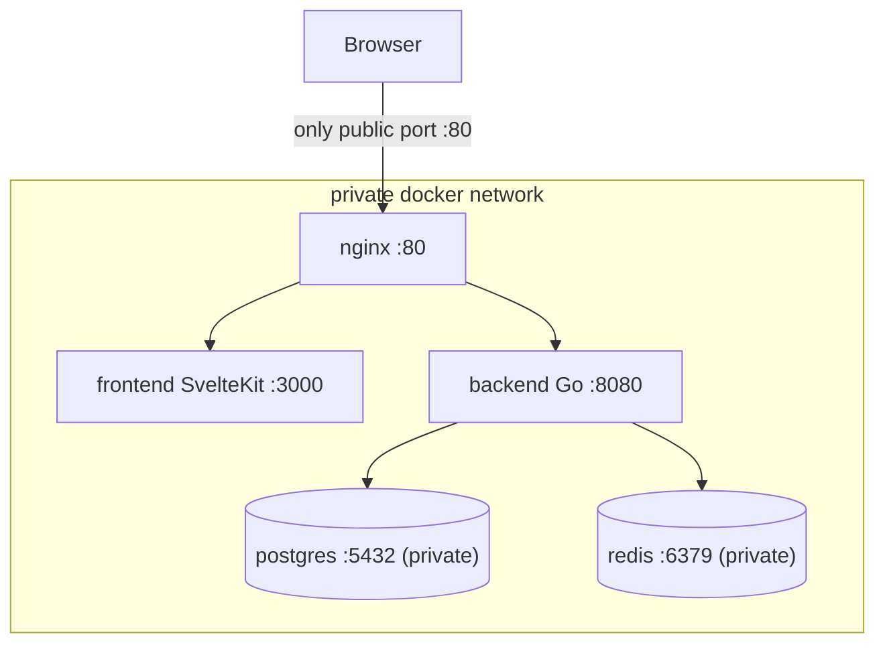

# Docker Architecture

Everything runs through containers. `docker compose up` is the single entrypoint.

> **Where to click after startup:** see [`docs/local-urls.md`](../docs/local-urls.md) for
> app, health, API, WebSocket, and optional Grafana URLs.

## Services (initial)

| Service | Image / build | Port | Public? | Purpose |
|---|---|---|---|---|
| `nginx` | `nginx:alpine` + config | 80, 443 | **yes** | reverse proxy, WS upgrade, dev TLS |
| `frontend` | `Dockerfile.dev` (Vite) or prod build | 3000 | no | SvelteKit |
| `backend` | `Dockerfile.dev` (Air) or prod build | 8080 | no | Go API + WS hub |
| `postgres` | `postgres:16-alpine` | 5432 | **no** | database (source of truth) |
| `redis` | `redis:7-alpine` | 6379 | **no** | realtime pub/sub + ephemeral state |

Security rule: **only nginx publishes a port.** `postgres` and `redis` have no `ports:`
mapping, so they are reachable only on the private compose network — never exposed publicly.

Monitoring services (Phase 5, **`monitoring` Compose profile** — included from
`infra/monitoring/docker-compose.monitoring.yml`):

| Service | Host port | Purpose |
|---|---|---|
| `grafana` | 3001 | Dashboards + log UI |
| `prometheus` | 9090 | Metrics store / query UI |
| `loki` | 3100 | Log store (queried via Grafana) |
| `promtail` | — | Ships container logs to Loki |

Start with: `docker compose --profile monitoring up -d`. Grafana login is set by
`GRAFANA_USER` and `GRAFANA_PASSWORD` in `.env` (see `.env.example`).

## Routing (nginx)
All public URLs use **`http://localhost`** (port 80). Full table: [`docs/local-urls.md`](local-urls.md).

- `/` → `frontend:3000` — **app UI** (home, meeting rooms)
- `/api/` → `backend:8080` — **REST API**
- `/ws` → `backend:8080` — **WebSocket** (signaling, chat, captions; upgrade headers)
- `/healthz`, `/readyz`, `/metrics` → `backend:8080` — **ops endpoints**

## Build Strategy

### Dev (`docker compose up`) — default

- **Backend**: `Dockerfile.dev` — Go toolchain + [Air](https://github.com/air-verse/air) hot reload; source bind-mounted from `./backend`.
- **Frontend**: `Dockerfile.dev` — Node + `npm run dev` (Vite HMR); source bind-mounted from `./frontend` with a named volume for `node_modules`.
- **nginx**: `infra/nginx/dev.conf` — proxies to Vite + backend; **HTTPS on :443** with self-signed certs (`bash scripts/generate-dev-certs.sh`) for phone camera/mic on LAN.
- **No rebuild** needed after code edits — only the first `docker compose up --build`.

### Production (`docker compose -f docker-compose.prod.yml up --build`)

- **Backend**: multi-stage build — `golang:1.26` builder → distroless/alpine runtime.
- **Frontend**: multi-stage — `node:26` builder → `node:26-alpine` runtime (adapter-node).

## Config & Secrets
- Environment via `.env` (compose interpolation) — sample provided as `.env.example`.
- Backend reads: `DATABASE_URL`, `REDIS_URL`, `PORT`, `LOG_LEVEL`, `CORS_ORIGINS`,
  `STT_PROVIDER`, `TRANSLATION_PROVIDER`, `DEFAULT_TARGET_LANG`, provider API keys.
- Postgres: `POSTGRES_USER`, `POSTGRES_PASSWORD`, `POSTGRES_DB`.
- Monitoring profile: `GRAFANA_USER`, `GRAFANA_PASSWORD`, optional `COMPOSE_PROFILES=monitoring`.

## Health & Ordering
- `postgres` has a healthcheck (`pg_isready`); `redis` has a healthcheck (`redis-cli ping`).
- `backend` `depends_on` both postgres and redis with `condition: service_healthy`.
- `backend` runs migrations on startup (idempotent) before serving.

## Volumes & Networks (data safety)
- Named volume `postgres_data` → `/var/lib/postgresql/data` (database persistence).
- Named volume `redis_data` → `/data` (redis runs with `--appendonly yes` for durability).
- Containers are disposable; **data survives restart, rebuild, and crash** via these volumes.
- Single user-defined bridge network (compose default) so services resolve by name and stay
  private (only nginx is published).

## Keep It Simple
- No Kubernetes, no service mesh for MVP.
- Add services only when a concrete need appears (e.g., TURN server for NAT traversal).
