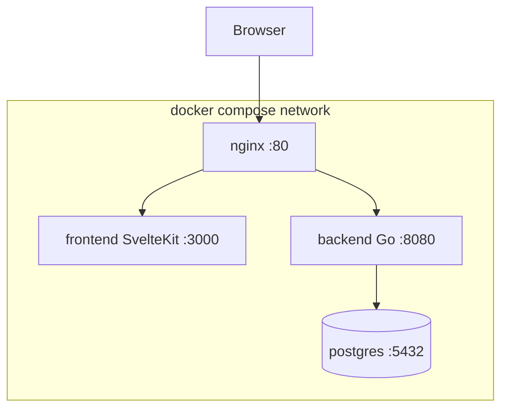

# Docker Architecture

Everything runs through containers. `docker compose up` is the single entrypoint.

## Services (initial)

| Service | Image / build | Port (internal) | Purpose |
|---|---|---|---|
| `nginx` | `nginx:alpine` + config | 80 (exposed) | reverse proxy, WS upgrade, single entry |
| `frontend` | build `frontend/` | 3000 | SvelteKit (Node adapter) |
| `backend` | build `backend/` | 8080 | Go API + WS hub |
| `postgres` | `postgres:16-alpine` | 5432 | database |

Monitoring services (Phase 5, separate `infra/monitoring/docker-compose.yml` overlay):
`prometheus`, `grafana`, `loki`, `promtail` / OTel collector.

## Routing (nginx)
- `/` → `frontend:3000`
- `/api/` → `backend:8080`
- `/ws` → `backend:8080` (with `Upgrade`/`Connection` headers for WebSocket)
- `/healthz`, `/readyz`, `/metrics` → `backend:8080`

## Build Strategy
- **Backend**: multi-stage build — `golang:1.26` builder → distroless/alpine runtime.
- **Frontend**: multi-stage — `node:26` builder → `node:26-alpine` runtime (adapter-node).
- Dev: bind mounts + hot reload optional later; MVP uses built images.

## Config & Secrets
- Environment via `.env` (compose `env_file`) — sample provided as `.env.example`.
- Backend reads: `DATABASE_URL`, `PORT`, `LOG_LEVEL`, `CORS_ORIGINS`, `STT_PROVIDER`,
  `TRANSLATION_PROVIDER`, provider API keys.
- Postgres: `POSTGRES_USER`, `POSTGRES_PASSWORD`, `POSTGRES_DB`.

## Health & Ordering
- `postgres` has a healthcheck (`pg_isready`).
- `backend` `depends_on` postgres `condition: service_healthy`.
- `backend` runs migrations on startup (idempotent) before serving.

## Volumes & Networks
- Named volume `pgdata` for Postgres persistence.
- Single user-defined bridge network (compose default) so services resolve by name.

## Keep It Simple
- No Kubernetes, no service mesh for MVP.
- Add services only when a concrete need appears (e.g., Redis for multi-instance WS,
  TURN server for NAT traversal).
